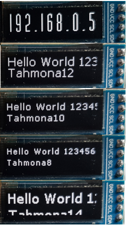

#Simple C# display driver for the SSD1306.



- Simple to use
- Includes Fonts, Tahmona 8 - 14 and DinerRegular24
- Built in Linux I2C driver
- Optional Proportional spacing


###Example

```
    using (var i2cBus = new I2CBus("/dev/i2c-1"))
    {
        var i2cDevice = new I2CDevice(i2cBus, Display.DefaultI2CAddress);
    
        display = new SSD1306.Display(i2cDevice,128,32);
        display.Init();
    
        var tahmona12 = new Tahmona12();
    
        display.WriteLineBuff(dfont,"Hello World 123456","Line 2 xxxx");
        display.DisplayUpdate();
    }
```
###Proportional spacing.
```
    var dinerRegular24 = new DinerRegular24();
    display.WriteLineBuffProportional(dinerRegular24,"192.168.0.5");                
    display.DisplayUpdate();
```